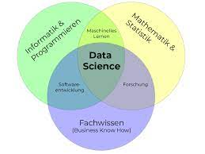

 <a href="https://github.com/MWelHeb/empirical_eyes/blob/master/README.md">Back to emprical eyes</a> 

# Analyzing survival probability on the Titanic 

Below is the link to a Notebook which outlines my approach with regards to the legendary Titanic ML competition on Kaggle. 
